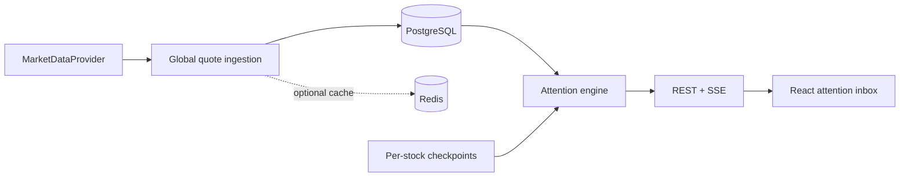

# DELTA

> **Don’t watch the market. Catch up on what actually changed.**

Delta is a smart Indian-market watchlist built for CODE 2026 by Groww. Instead of repeating today’s prices, it remembers a separate knowledge checkpoint for every user–instrument pair and answers: **what changed since I last checked, and what deserves attention now?** All bundled prices are deterministic simulated demo data.

## Why Delta is different

- The first screen is an **attention inbox**, not a quote table.
- Every stock has an intentional acknowledgement checkpoint; auto-refresh never moves it.
- Deterministic signals produce a 0–100 score and expose every contribution.
- Quiet stocks are collapsed, making inactivity reassuring.
- `LIVE`, `DELAYED`, `STALE`, and `CONFLICTED` are visible product states.
- The language is responsible: quiet, worth watching, needs attention—never buy or sell.

## Architecture



A **modular monolith** was chosen deliberately: it gives clear domain boundaries without the deployment and failure overhead of distributed services. Market prices are global and ingested once; attention is user-specific and calculated against each relationship’s checkpoint. These boundaries can later become services.

## Domain model

`User → Watchlist → WatchlistItem → Instrument`; a `MarketQuote` belongs to an instrument globally, while `MarketSnapshot`, `ChangeEvent`, and acknowledgement belong to `User + Instrument`. The implemented vertical slice keeps the provider, checkpoint, attention, API, and UI boundaries explicit. PostgreSQL is the source of truth; Redis is optional.

## Attention engine

```text
priceShock = abs(returnSinceSeen) / expectedMoveForElapsedPeriod
score = min(100,
  35 × normalize(priceShock) +
  20 × normalize(volumeRatio) +
  15 × normalize(volatilityRatio) +
  15 × normalize(abs(stockReturn - benchmarkReturn)) +
  15 × rangeBreakout)
```

`0–29 QUIET`, `30–59 WORTH_WATCHING`, `60–100 NEEDS_ATTENTION`. Inputs are verified structured values; prose is rendered from those values. No LLM participates in scoring or fact generation.

## Reliability

Quotes carry exchange timestamp, receipt timestamp, provider, and quality. Exchange time—not arrival time—orders updates, so a delayed old tick cannot overwrite a newer quote. Provider failure is designed to fall back to the last-known-good quote and mark it `STALE`; disagreement becomes `CONFLICTED`. The mock provider exposes deterministic stale/conflict scenarios from the sidebar and `POST /api/dev/scenarios/{scenario}`.

## Why SSE

Updates are predominantly server → browser. SSE uses ordinary HTTP, reconnects natively, and has less operational complexity than WebSockets. The backend includes `/api/stream/watchlist/{id}` as the streaming boundary.

## Run locally

Requirements: Node 22+, Java 21, Docker (optional).

```bash
npm install
npm run dev
cd backend && ./mvnw spring-boot:run
```

Or start PostgreSQL and Redis with `docker compose up -d`. The backend defaults to an H2 PostgreSQL-compatible demo profile when `DATABASE_URL` is absent. Configure from `.env.example`.

## Demo

1. Open Delta directly as the persistent demo investor; no login step interrupts the core flow.
2. Open Attention: two instruments need attention and quiet stocks are collapsed.
3. Open Tata Motors and inspect its deterministic change story, compact chart, and timeline.
4. Select **Mark seen**; only Tata Motors’ persisted checkpoint resets.
5. Use Watchlists to create, rename, delete, or remove instruments; use Explore to search and add stocks.
6. Select **Stale provider** or **Conflicting providers** in the demo control.
7. Open **Data status** to see degraded state made explicit.

## Tests

`npm run build` validates the frontend. `cd backend && mvn test` covers scoring, classification, independent checkpoints, and out-of-order quote rejection. See [edge cases](docs/EDGE_CASES.md), [trade-offs](docs/TRADEOFFS.md), [scaling](docs/SCALING.md), and [evaluator Q&A](docs/EVALUATOR_QA.md).

## Implementation status and limitations

The single-user demo, watchlists, items, and per-instrument checkpoints persist in file-backed H2 by default and can use PostgreSQL through `DATABASE_URL`. Market quotes remain global deterministic simulated data behind `MarketDataProvider`; production provider credentials, complete NSE holiday rules, corporate-action adjustment, and distributed rate limiting are future work. Failure scenarios preserve explicit quality status and the last verified value. Simulated prices are never represented as exchange-live. Explore summaries are deterministic verified text; the optional LLM rephrasing path is intentionally not enabled.
