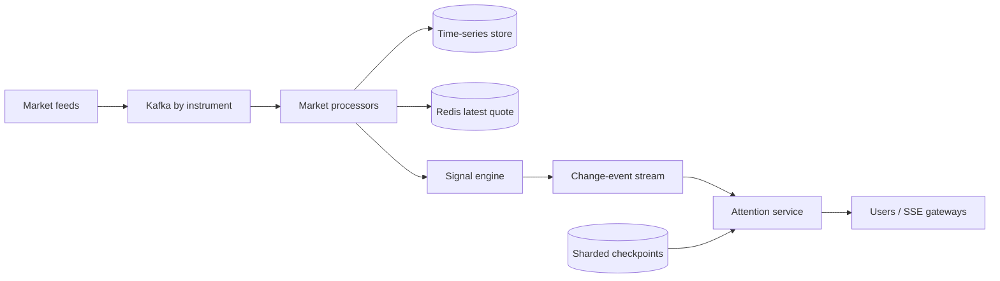

# Scaling Delta

## Hackathon

One modular monolith owns REST/SSE, checkpoints, watchlists and attention. A single ingestion process fetches each instrument once. PostgreSQL is truth; Redis caches the latest global quote. User attention joins that global state with the user–instrument checkpoint.

## Large scale

Market ingestion scales by **instrument count and tick rate**. Attention scales independently by **user–watchlist relationships**. The same Reliance quote is never refetched per user. For 50 million relationships, partition checkpoints by user, keep latest quotes instrument-keyed, evaluate only relationships affected by changed instruments, materialize high-score inbox rows, and fan out through regional SSE gateways. Kafka provides replay and idempotent event keys prevent duplicate change events.
